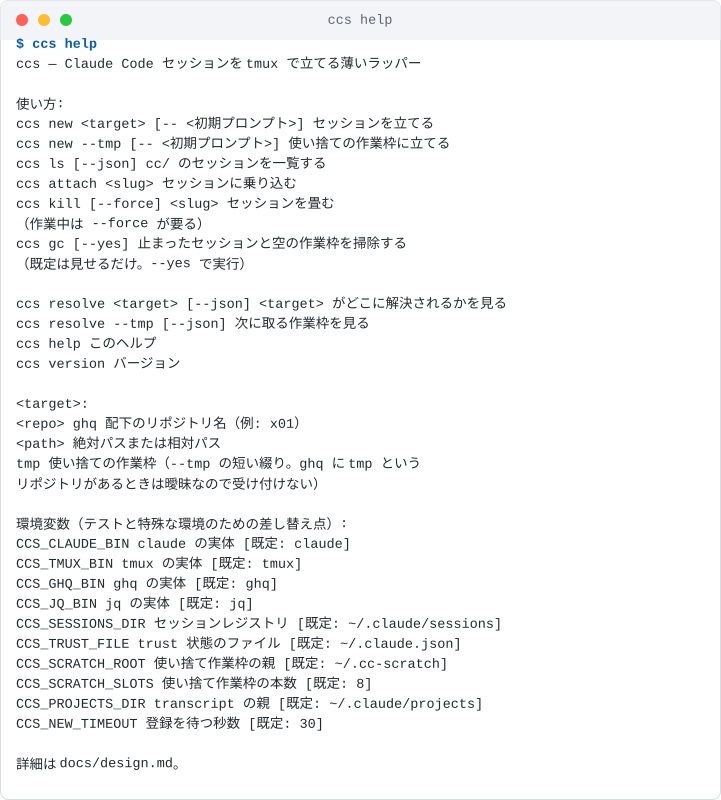
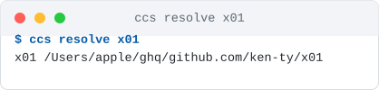
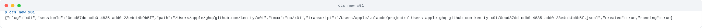
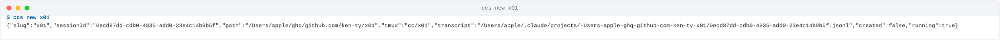
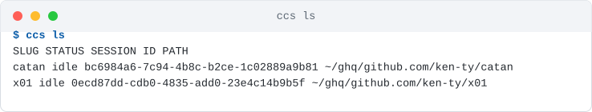
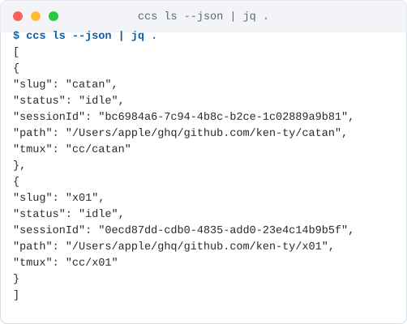
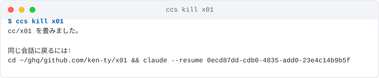
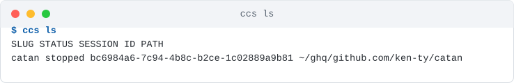
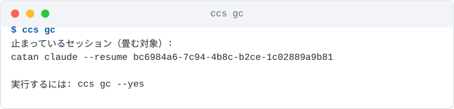
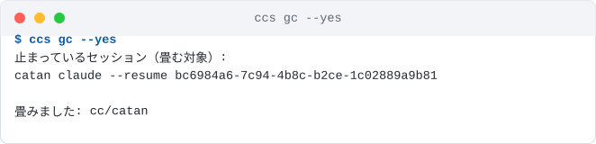

# はじめてのセッション

`ccs` を入れて、セッションを立て、使い、畳むまで。

!!! note "画像はすべて実際の実行結果です"
    このページの端末画像は、本物の `claude` で `ccs` を動かして取った出力を
    そのまま SVG にしたもの（`scripts/termshot.py`）。作り物の画面は 1 枚もない。

## 入れる

`ccs` はシェルスクリプト 1 本なので、PATH の通った場所に symlink を張るだけ。

```bash
git clone git@github.com:ken-ty/ccs.git ~/ghq/github.com/ken-ty/ccs
ln -sf ~/ghq/github.com/ken-ty/ccs/bin/ccs ~/.local/bin/ccs
```

必要なものは `tmux` と `jq`、それに `claude` 2.1.x 以降。

```bash
brew install tmux jq
```

入ったか確かめる。



## どこに立つかを先に見る

いきなり立てる前に、`resolve` でどこに解決されるかを見られる。**副作用が無い**ので、
打ち間違いに気づくのはここが一番安い。



リポジトリ名は ghq 配下から末尾一致で引く。`x01` でも `ken-ty/x01` でも
`github.com/ken-ty/x01` でも同じ結果になる。

!!! warning "同名のリポジトリが複数あるときは選ばない"
    `Dimillian/IceCubesApp` と `ken-ty/IceCubesApp` のように名前が衝突していると、
    `ccs` は候補を出して止まる。どちらを指したかは打った人にしか分からない。
    `<owner>/<repo>` の形で指定し直す。

## 立てる



返ってくるのは 1 行の JSON。ハブのエージェントがそのままパースできる。

| キー | 中身 |
| --- | --- |
| `slug` | この先ずっと使う識別子。tmux セッション名は `cc/<slug>` |
| `sessionId` | Claude のセッション ID。**あとで手動復帰するときに要る** |
| `path` | 実際の作業ディレクトリ |
| `transcript` | 会話ログの**予測パス**。初回のやり取りが起きるまでファイルは作られない |
| `created` | 新しく立てたか、既にあったものを返したか |

立った直後から、ハブの `ListAgents` に `<slug>` として現れる。**これはシェルのコマンドではない** —
`ListAgents` はエージェントの組み込みツールなので、ハブのチャットにこう打つ。

```bash
> ListAgents で今あるセッションを見せて
Peer sessions (7):
  catan [e679d3]  ·  interactive  ·  idle  ·  started 6s ago
  x01 [80bd9b]  ·  interactive  ·  idle  ·  started 17s ago
```

あとは `SendMessage` で指示を送れる — これが `ccs` を作った理由そのもの。

> x01 のセッションに「このリポジトリの README の見出しだけ列挙して」と頼んで、結果を教えて

### 二度立てても増えない

同じ対象をもう一度頼むと、**立て直さずに既にあるものを返す**。`created` が `false` に変わる。



二重に立つと、同じ作業ツリーを 2 本の claude が触ることになる。ハブは「その名前の
セッションが欲しい」と言っているのであって、「必ず新しく作れ」ではない。

### 初期プロンプトを渡す

`--` の後ろはそのまま claude に渡る。

```bash
ccs new x01 -- 'テストを走らせて、落ちていたら原因だけ教えて'
```

### 使い捨ての作業枠

ちょっとした調べ物に、リポジトリを汚さない場所が欲しいときは `--tmp`。

```bash
ccs new --tmp     # ~/.cc-scratch/1 に立つ。slug は tmp-1
ccs new --tmp     # 2 本目は ~/.cc-scratch/2。slug は tmp-2
```

枠は 8 本で固定。**枠が有限なこと自体が、使い捨てセッションを増やしすぎない歯止め**になっている。
空いている枠（中身が空で、セッションも立っていない枠）を若い番号から取る。

`ccs new tmp` と短く書いてもよい。ただし ghq に `tmp` という名前のリポジトリがあると
どちらを指したのか決められないので、そのときだけ `ccs` は候補を出して止まる。

!!! info "ghq の外は信頼確認が出る"
    Claude Code は初めて見るディレクトリで信頼確認を出して止まる。`ccs` が自動で
    信頼済みにするのは **ghq 配下のリポジトリ**と**空の使い捨て作業枠**だけ。
    どちらも「知らないコードがそこに無い」と言い切れる場所だから。
    それ以外は自動承認しない — ツールが安全確認を黙って潰さないため。確認が出ることは
    立てる前に伝えるので、`ccs attach <slug>` で「1. Yes, I trust this folder」を選ぶ。
    一度答えれば以後は出ない。

## 見る



`SESSION ID` は省略せずそのまま出る。**手で `claude --resume` に貼るため**で、
v1 に `resume` が無い以上、ここが唯一の導線になる。

ハブから読むなら `--json`。



`cc/` が付かない tmux セッション（自分で開いた作業用のもの）は一覧に出ない。

## 乗り込む

```bash
ccs attach x01
```

すでに tmux の中にいれば `switch-client`、外にいれば `attach-session` に切り替わる。
ハブ自体を tmux で走らせていても乗り込める。

## 畳む



**畳むときに復帰コマンドが出る。** 会話そのものは Claude 側に残っているので、
これを貼れば同じ続きに戻れる。

!!! danger "作業中は畳まない"
    `status` が `working` のセッションは `--force` なしでは畳まない。会話は残るが、
    走っていたコマンドの途中経過は戻らない。

## 止まったセッション

claude が終了してもペインは残る。一覧では `stopped` になる。



**`sessionId` はここでも出る。** ペインの起動コマンドから拾っているので、
畳む前なら必ず取れる。

## 掃除する

`gc` は止まったセッションと空の作業枠を片付ける。**既定は見せるだけ。**



内容を確かめてから `--yes` を付ける。



!!! warning "中身の残った作業枠は消さない"
    `gc` が消すのは**空の**枠だけ。中に何か置いてある枠は報告するだけで触らない。
    そこにあるのは自分のファイルで、消えたら戻らない。片付けるかどうかは人が決める。

## 次に読むもの

- [手を動かして確かめる](hands-on.md) — 実機で 1 周する手順（期待される出力つき）
- [設計調査](design.md) — なぜこの形なのか。実測の証拠つき
